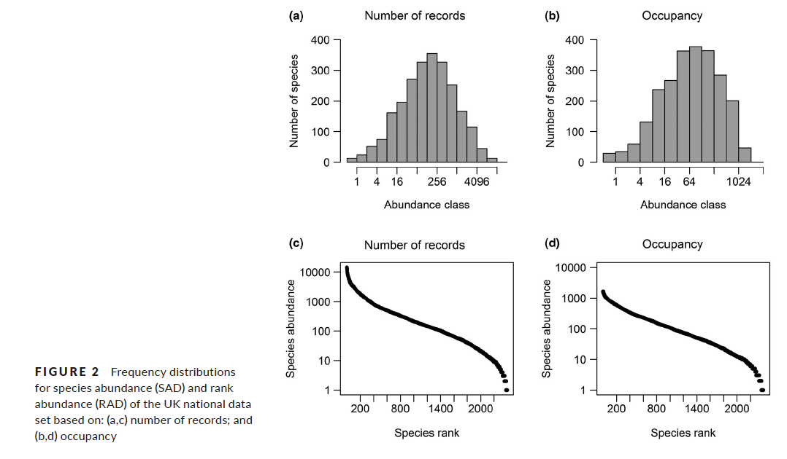
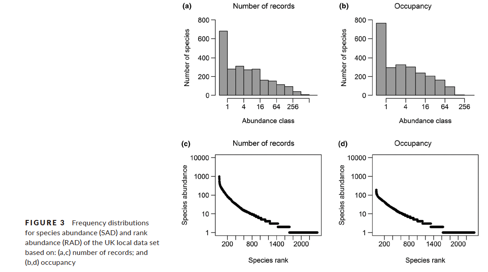
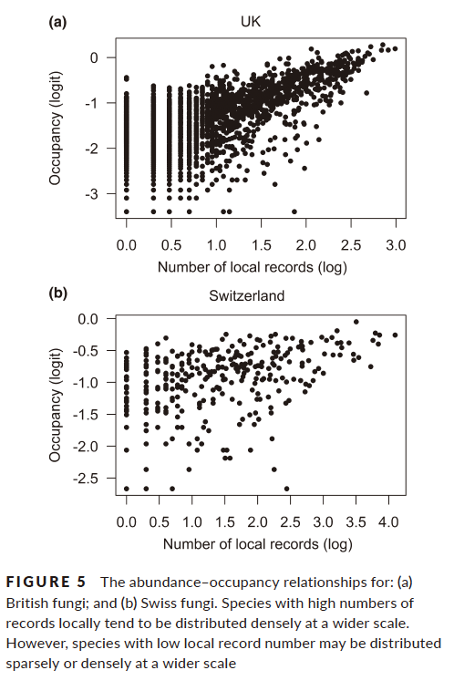
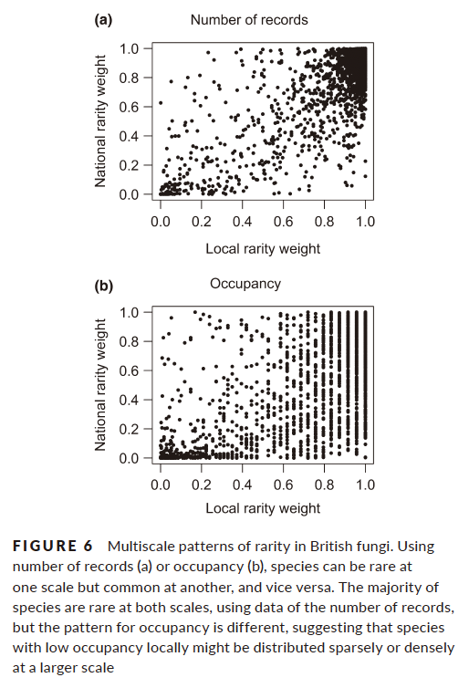

```{r setup, include=FALSE}
knitr::opts_chunk$set(echo = TRUE, warning = FALSE, comment = "##", prompt = TRUE, tidy = TRUE, tidy.opts = list(width.cutoff = 75), fig.path = "img/")
```

## Paper Overview

I replicate the analysis in the paper "Multiscale patterns of rarity in fungi, inferred from fruiting records" by Gange et al. (2019) The study investigated whether fungi exhibit similar macroecological patterns of abundance and spatial distribution as other organisms. Specifically, the authors examined fungal abundance-occupancy relationships to determine if fungi that are common at a local scale tend to be more widely distributed at broader regional scales. The authors used datasets of fungal fruiting records from the UK and Switzerland, and there are four main types of analyses: Species abundance distributions (SADs), Rank abundance distributions (RADs), Abundance-occupancy relationships, and Multiscale indices of rarity.

For this replication, I will focus on three key analyses from the paper:

1.  Species abundance distribution analysis (descriptive) - Figure 2 and 3
2.  Abundance-occupancy relationship analysis (inferential) - Figure 5
3.  Multiscale indices of rarity (inferential) - Figure 6

## Data Exploration

```{r}
#load necessary libraries
library(tidyverse)
library(vegan)
library(sads)
library(mgcv)
library(car)
library(curl)
library(readr)
```

Since there are two sheets in Excel file, I separated them as UK_data.csv and Swiss_data.csv. (The original data were obtained from the Dryad (DOI: 10.5061/dryad.h36dj4t) and split into UK (2,319 species) and Swiss (319 species) datasets.)

count = abundance data
grid = range data
National = national data
logit = logit transformation

Supplementry Table S1.  Complete species list for the UK, with raw data showing abundance (number of records) and range (occupancy)

```{r}
UK <- curl("https://raw.githubusercontent.com/msbrendakim/AN588-Replication/refs/heads/main/UK_data.csv")
UK_data <- read_csv(UK)

dim(UK_data)
anyNA(UK_data)
summary(UK_data)
head(UK_data)
```

Supplementry Table S2.  Complete species list for Switzerland, with raw data showing abundance (number of records) and range (occupancy)

```{r}
s <- curl("https://raw.githubusercontent.com/msbrendakim/AN588-Replication/refs/heads/main/Swiss_data.csv")
Swiss_data <- read_csv(s)

dim(Swiss_data)
anyNA(Swiss_data)
summary(Swiss_data)
head(Swiss_data)
```

The UK dataset includes 2,319 species with 62,087 local and 1,361,069 national records. The Swiss dataset includes 319 species with 97,358 national records. No missing values were found.

### Analysis 1: Species Abundance Distributions (SAD) (Figure 2 and 3)
##### UK National SAD
```{r}
# UK National scale (Figure 2)
hist(log10(UK_data$FRDBI_count), breaks = 30, 
     main = "UK National Records Distribution (log10 scale)",
     xlab = "Number of Records (log10)",
     ylab = "Number of species")

# Fit distributions to UK national data
UK_nat_lnorm <- fitsad(UK_data$FRDBI_count, "lnorm")
UK_nat_pareto <- fitsad(UK_data$FRDBI_count, "pareto")
UK_nat_weibull <- fitsad(UK_data$FRDBI_count, "weibull")

# Compare model fits using AIC
UK_nat_aic <- AIC(UK_nat_lnorm, UK_nat_pareto, UK_nat_weibull)
UK_nat_aic

# Plot the best fitting distribution for national data
plot(UK_nat_lnorm, main = "UK National Records: Lognormal Fit")

```

##### Original Figure


The UK national SAD was best fitted by a lognormal distribution with an AIC of 32323.19, compared to the paper’s 33,305.1.

##### UK Local SAD (Figure 3)
```{r}
# UK Local scale - Species Abundance Distribution (Figure 3a)
hist(log10(UK_data$count), breaks = 30, 
     main = "UK Local Records Distribution (log10 scale)",
     xlab = "Number of Records (log10)",
     ylab = "Number of species")

# Fit distributions to UK local data
UK_loc_lnorm <- fitsad(UK_data$count, "lnorm")
UK_loc_pareto <- fitsad(UK_data$count, "pareto") 
UK_loc_weibull <- fitsad(UK_data$count, "weibull")

# Compare model fits using AIC
UK_loc_aic <- AIC(UK_loc_lnorm, UK_loc_pareto, UK_loc_weibull)
UK_loc_aic

# Plot the best fitting distribution for local data
plot(UK_loc_pareto, main = "UK Local Records: Pareto Fit")
```

##### Original Figure


The UK local SAD was best fitted by a Pareto distribution with an AIC of 15262.85, matching the paper’s -15,594.8.

## Analysis 2: Abundance-Occupancy Relationships (Figure 5)

```{r}
# Transform data as described in the paper
UK_data$log_local_abundance <- log10(UK_data$count)
UK_data$logit_national_occupancy <- UK_data$logit_FRDB_grid

# Plot abundance-occupancy relationship for UK (Figure 5a)
uk_ao_plot <- ggplot(UK_data, aes(x = log_local_abundance, y = logit_national_occupancy)) +
  geom_point(alpha = 0.5, size = 1) +
  geom_smooth(method = "gam", formula = y ~ s(x), color = "blue") +
  labs(title = "The abundance-occupancy relationship for UK fungi",
       x = "Number of local records (log)",
       y = "Occupancy (logit)") +
  theme_classic()

print(uk_ao_plot)

# Linear model for UK
UK_ao_linear <- lm(logit_national_occupancy ~ log_local_abundance, data = UK_data)
summary(UK_ao_linear)

# Nonlinear model (GAM) for UK
UK_ao_gam <- gam(logit_national_occupancy ~ s(log_local_abundance), data = UK_data)
summary(UK_ao_gam)

# Compare R² values for UK
cat("UK Linear model R²:", summary(UK_ao_linear)$r.squared, "\n")
cat("UK GAM model R²:", summary(UK_ao_gam)$r.sq, "\n")

# Prepare data for abundance-occupancy relationship for Swiss data
Swiss_data$log_local_abundance <- log10(Swiss_data$count)
Swiss_data$logit_national_occupancy <- Swiss_data$logit_National_grid  # Using the pre-calculated logit value

# Plot Swiss abundance-occupancy relationship (Figure 5b)
swiss_ao_plot <- ggplot(Swiss_data, aes(x = log_local_abundance, y = logit_national_occupancy)) +
  geom_point(alpha = 0.5, size = 1) +
  geom_smooth(method = "gam", formula = y ~ s(x), color = "blue") +
  labs(title = "The abundance-occupancy relationship for Swiss fungi",
       x = "Number of local records (log)",
       y = "Occupancy (logit)") +
  theme_classic()

print(swiss_ao_plot)

# Models for Swiss data
Swiss_ao_linear <- lm(logit_national_occupancy ~ log_local_abundance, data = Swiss_data)
Swiss_ao_gam <- gam(logit_national_occupancy ~ s(log_local_abundance), data = Swiss_data)

# Compare R² values for Swiss data
cat("Swiss Linear model R²:", summary(Swiss_ao_linear)$r.squared, "\n")
cat("Swiss GAM model R²:", summary(Swiss_ao_gam)$r.sq, "\n")
```

##### Original Figure


### Analysis 3: Multiscale Indices of Rarity (Figure 6)

```{r}
# Calculate quartile cutoff values (25th percentile) for UK data
uk_local_cutoff <- quantile(UK_data$count, 0.25)
uk_national_cutoff <- quantile(UK_data$FRDBI_count, 0.25)

# Create rarity weights for UK data (scaled 0-1, higher = more rare)
UK_data$local_rarity <- 1 - (rank(UK_data$count) / nrow(UK_data))
UK_data$national_rarity <- 1 - (rank(UK_data$FRDBI_count) / nrow(UK_data))

# Plot UK multiscale rarity (Figure 6a)
uk_rarity_plot <- ggplot(UK_data, aes(x = local_rarity, y = national_rarity)) +
  geom_point(alpha = 0.5) +
  labs(title = "Multiscale patterns of rarity in UK fungi",
       x = "Local rarity weight",
       y = "National rarity weight") +
  theme_classic()

print(uk_rarity_plot)

# Calculate the relationship
UK_rarity_model <- lm(national_rarity ~ local_rarity, data = UK_data)
summary(UK_rarity_model)

# Calculate proportion of species in different rarity categories
# Using the cutoff values (25th percentile)
UK_rare_local <- sum(UK_data$count <= uk_local_cutoff) / nrow(UK_data)
UK_rare_national <- sum(UK_data$FRDBI_count <= uk_national_cutoff) / nrow(UK_data)
UK_rare_both <- sum(UK_data$count <= uk_local_cutoff & 
                   UK_data$FRDBI_count <= uk_national_cutoff) / nrow(UK_data)
UK_common_both <- sum(UK_data$count > uk_local_cutoff & 
                     UK_data$FRDBI_count > uk_national_cutoff) / nrow(UK_data)
UK_rare_local_common_national <- sum(UK_data$count <= uk_local_cutoff & 
                                    UK_data$FRDBI_count > uk_national_cutoff) / nrow(UK_data)
UK_common_local_rare_national <- sum(UK_data$count > uk_local_cutoff & 
                                    UK_data$FRDBI_count <= uk_national_cutoff) / nrow(UK_data)

# Create table similar to Table 1 in the paper
UK_rarity_table <- data.frame(
  Category = c("Rare at both scales", "Common at both scales", 
               "Rare local, common national", "Common local, rare national"),
  Percentage = c(UK_rare_both, UK_common_both, 
                 UK_rare_local_common_national, UK_common_local_rare_national) * 100
)
print(UK_rarity_table)

# Repeat for Swiss data
swiss_local_cutoff <- quantile(Swiss_data$count, 0.25)
swiss_national_cutoff <- quantile(Swiss_data$National_count, 0.25)

Swiss_data$local_rarity <- 1 - (rank(Swiss_data$count) / nrow(Swiss_data))
Swiss_data$national_rarity <- 1 - (rank(Swiss_data$National_count) / nrow(Swiss_data))

# Plot Swiss multiscale rarity
swiss_rarity_plot <- ggplot(Swiss_data, aes(x = local_rarity, y = national_rarity)) +
  geom_point(alpha = 0.5) +
  labs(title = "Multiscale patterns of rarity in Swiss fungi",
       x = "Local rarity weight",
       y = "National rarity weight") +
  theme_classic()

print(swiss_rarity_plot)

# Calculate Swiss rarity categories
Swiss_rare_both <- sum(Swiss_data$count <= swiss_local_cutoff & 
                      Swiss_data$National_count <= swiss_national_cutoff) / nrow(Swiss_data)
Swiss_common_both <- sum(Swiss_data$count > swiss_local_cutoff & 
                        Swiss_data$National_count > swiss_national_cutoff) / nrow(Swiss_data)
Swiss_rare_local_common_national <- sum(Swiss_data$count <= swiss_local_cutoff & 
                                       Swiss_data$National_count > swiss_national_cutoff) / nrow(Swiss_data)
Swiss_common_local_rare_national <- sum(Swiss_data$count > swiss_local_cutoff & 
                                       Swiss_data$National_count <= swiss_national_cutoff) / nrow(Swiss_data)

# Create Swiss rarity table
Swiss_rarity_table <- data.frame(
  Category = c("Rare at both scales", "Common at both scales", 
               "Rare local, common national", "Common local, rare national"),
  Percentage = c(Swiss_rare_both, Swiss_common_both, 
                 Swiss_rare_local_common_national, Swiss_common_local_rare_national) * 100
)
print(Swiss_rarity_table)
```

##### Original Figure
